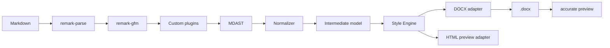
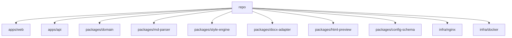

# Создание веб-приложения Markdown → DOCX с гибкими настройками

## Executive summary

Лучшее решение для такого продукта — веб-приложение с общим AST-пайплайном `remark/unified`, отдельным Style Engine и двумя режимами предпросмотра: быстрый HTML docx-like preview и более точный preview через уже сгенерированный `.docx`. Для генерации `.docx` в Node.js/TypeScript рационально использовать библиотеку `docx`, потому что она рассчитана на OOXML-документы и уже покрывает секции, стили, таблицы, изображения, футноты, поля и другие базовые строительные блоки. citeturn38search1turn38search0turn38search7turn38search9

UI для «каждого XML-атрибута OOXML» делать не стоит. ECMA white paper прямо показывает, что Office Open XML — это большой многосоставный стандарт, а WordprocessingML-документ строится как OPC package из частей и relationship parts. Практически правильный путь — покрыть все часто используемые настройки через нормальный визуальный UI, а редкие и экзотические вещи вынести в advanced JSON / OOXML override. citeturn29view0turn30view0turn19search19

Рекомендуемый релизный план такой: MVP — Markdown upload/edit, JSON import/export, визуальные стили для основных Markdown-элементов, live preview, DOCX export, warnings по unsupported syntax и invalid XML chars, пресеты; R2 — headers/footers, page numbers, footnotes/endnotes, batch, import `.docx` template/style packs, API token, versioning configs; R3 — comments, bookmarks, fields UI, track changes, floating images и accurate preview pipeline через `docx-preview`/PDF. Такой порядок соответствует стоимости реализации и зрелости экосистемы. citeturn35search1turn35search2turn35search3turn36search1turn37search0turn37search2turn18view2

Файлы отчёта: [Markdown](sandbox:/mnt/data/markdown-docx-converter-report.md), [PDF](sandbox:/mnt/data/markdown-docx-converter-report.pdf)

## Анализ Markdown и mapping в DOCX

CommonMark покрывает базовые блоки и inline-элементы Markdown. GFM добавляет tables, task lists, strikethrough и расширенные autolinks. GitHub Docs отдельно документируют footnotes. Mermaid в Markdown обычно живёт внутри fenced code block с языком `mermaid`. В экосистеме `remark` это естественно представляется как mdast через `remark-parse`, `remark-gfm` и общий пайплайн `unified`. В русскоязычных GitHub Docs доступны те же базовые конструкции, включая headings, images, lists, task lists и footnotes. citeturn22view6turn22view7turn22view8turn22view9turn25search0turn28search0turn8search17turn8search15turn8search11turn9search8

| Markdown элемент | DOCX mapping | Статус |
|---|---|---|
| Paragraph | `w:p` + paragraph style | Полная поддержка |
| Headings h1–h6 | paragraph styles | Полная поддержка |
| Thematic break | separator paragraph / border | Полная поддержка |
| Blockquote | left indent + border + style | Полная поддержка |
| Ordered / bullet list | `numbering.xml`, `numId`, `ilvl` | Полная поддержка |
| Nested lists | multi-level numbering | Полная поддержка |
| Fenced / indented code block | monospace paragraph style | Полная поддержка |
| Inline code | character style / run style | Полная поддержка |
| Emphasis / strong / strike | run properties | Полная поддержка |
| Links / autolinks | hyperlink relationship | Полная поддержка |
| Images | inline / floating drawing | Полная поддержка |
| Tables | `w:tbl` | Полная поддержка |
| Task lists | numbering + checkbox glyph | Полная поддержка |
| Footnotes | footnotes part + reference run | Полная поддержка |
| HTML inline / block | whitelist subset или warning | Ограниченное подмножество |
| Mermaid | SVG/PNG после pre-render | Полная поддержка через image |

Mermaid нельзя отдавать в DOCX как raw syntax. Его нужно рендерить в SVG/PNG и вставлять как обычное изображение. Raw HTML тоже нельзя обещать конвертировать «как браузер»: реалистичный путь — безопасный whitelist subset и warnings для всего остального. citeturn9search1turn9search8turn37search0turn37search2

Со стороны DOCX приложение должно покрывать document body, `sectPr`, `styles.xml`, `numbering.xml`, paragraph props, run props, tables, images, headers/footers, footnotes/endnotes, fields, bookmarks, comments, revisions, theme fonts и metadata. WordprocessingML прямо документирует paragraphs, styles, sections, tables, footnotes, comment content и bookmark start; DrawingML различает inline и floating objects, а wrapping на уровне anchor поддерживает square, tight, through, top-bottom и none. citeturn19search19turn20search0turn19search20turn5search0turn20search5turn34search1turn34search8turn35search1turn35search2turn35search3turn37search0turn37search1turn37search2turn37search10

Отдельно важно, что OOXML-единицы измерения неоднородны. Для paragraph/page/table settings обычно используются twips; размер шрифта задаётся в half-points; изображения и DrawingML — в EMU. Следовательно, внутренний движок обязан иметь нормализатор единиц и никогда не полагаться на «голые числа из UI». citeturn17search0turn17search1turn17search8

## Модель конфигурации и JSON Schema

Для конфигурации нужен JSON Schema Draft 2020-12. Это актуальная версия JSON Schema, и она подходит одновременно для backend-валидации, документации API и диагностики в редакторе JSON. Monaco даёт редактор уровня VS Code; React Hook Form подходит для больших форм; Zod удобен как TypeScript-first слой вокруг UI-state. citeturn32search2turn32search0turn11search4turn11search2turn11search5

Рекомендуемая top-level структура конфига выглядит так:

```json
{
  "version": "1.0.0",
  "meta": {},
  "input": {},
  "document": {},
  "defaults": {},
  "styles": {},
  "numbering": {},
  "headersFooters": {},
  "advanced": {}
}
```

Смысл иерархии такой: `defaults` задаёт document-wide baseline; `styles` задаёт named mappings для Markdown-элементов; `numbering` управляет bullet/ordered/nested lists; `advanced` хранит редкие флаги типа template merge, comments, bookmarks, revisions и raw OOXML overrides. Это повторяет реальную логику WordprocessingML: document defaults → styles → direct formatting. citeturn38search9turn19search20

Пример рабочего конфига:

```json
{
  "$schema": "https://json-schema.org/draft/2020-12/schema",
  "version": "1.0.0",
  "meta": {
    "name": "Corporate A4 RU",
    "locale": "ru-RU"
  },
  "input": {
    "markdownProfile": "commonmark-gfm",
    "enableHtmlSubset": true,
    "enableMermaid": true,
    "htmlPolicy": "sanitize-whitelist",
    "onUnsupportedNode": "warn-and-skip",
    "onInvalidXmlChar": "warn-and-skip"
  },
  "document": {
    "page": {
      "size": { "preset": "A4", "orientation": "portrait" },
      "margin": {
        "topTwip": 1440,
        "rightTwip": 1440,
        "bottomTwip": 1440,
        "leftTwip": 1440
      }
    },
    "metadata": {
      "title": "Документ",
      "category": "report"
    }
  },
  "defaults": {
    "paragraph": {
      "alignment": "both",
      "spacing": {
        "beforeTwip": 0,
        "afterTwip": 160,
        "lineTwip": 276,
        "lineRule": "auto"
      }
    },
    "run": {
      "font": {
        "ascii": "Times New Roman",
        "hAnsi": "Times New Roman",
        "cs": "Times New Roman"
      },
      "sizeHalfPt": 24
    }
  },
  "styles": {
    "heading1": {
      "paragraph": { "outlineLevel": 0 },
      "run": { "sizeHalfPt": 32, "bold": true }
    },
    "paragraph": {},
    "inlineCode": {
      "run": { "font": { "ascii": "Courier New" }, "sizeHalfPt": 22 }
    },
    "codeBlock": {
      "paragraph": {
        "spacing": {
          "beforeTwip": 120,
          "afterTwip": 120,
          "lineTwip": 240,
          "lineRule": "exact"
        }
      },
      "run": { "font": { "ascii": "Courier New" }, "sizeHalfPt": 20 }
    }
  },
  "numbering": {
    "bullet": {
      "levels": [
        { "level": 0, "format": "bullet", "text": "•", "leftTwip": 720, "hangingTwip": 360 }
      ]
    }
  },
  "headersFooters": {
    "defaultFooter": { "enabled": true, "content": ["PAGE / NUMPAGES"] }
  },
  "advanced": {
    "emitBookmarks": true,
    "emitComments": false,
    "trackRevisions": false,
    "ooxmlOverrides": {}
  }
}
```

Единицы измерения нужно явно объяснять на UI. Основные правила: `twip = 1/20 pt`; размер шрифта в `w:sz` задаётся в half-points; DrawingML использует EMU, где 1 inch = 914400 EMU и 1 pt = 12700 EMU. Из этого следует корректный UX: пользователь вводит pt/px/cm/%, а backend хранит canonical значения в twip / halfPt / emu / pct. citeturn17search0turn17search1turn17search8

| UI единица | Storage | Где использовать |
|---|---|---|
| pt | halfPt / twip | font size, spacing |
| px | emu | image width/height |
| cm/mm | twip | page margins, indents |
| % | pct | table width |
| twip | twip | canonical paragraph/page/table |
| emu | emu | drawings |

Сокращённый JSON Schema-фрагмент:

```json
{
  "$schema": "https://json-schema.org/draft/2020-12/schema",
  "type": "object",
  "required": ["version", "input", "document", "defaults", "styles"],
  "properties": {
    "version": { "type": "string", "pattern": "^\\d+\\.\\d+\\.\\d+$" },
    "input": {
      "type": "object",
      "required": ["markdownProfile", "onUnsupportedNode", "onInvalidXmlChar"],
      "properties": {
        "markdownProfile": { "enum": ["commonmark", "commonmark-gfm"] },
        "onUnsupportedNode": { "enum": ["warn-and-skip", "error", "fallback-text"] },
        "onInvalidXmlChar": { "enum": ["warn-and-skip", "error", "replace-uFFFD"] }
      },
      "additionalProperties": false
    }
  }
}
```

## UX, UI и preview

Интерфейс должен быть двухрежимным: visual mode и JSON mode. Между ними нужен честный round-trip: пользователь может импортировать JSON, увидеть его в визуальной форме, изменить параметры мышью и снова экспортировать JSON без потери структуры. Для этого нужен единый domain model, а не две независимые модели на frontend и backend. citeturn11search4turn11search2turn11search5

Рекомендуемый layout:

| Зона | Содержимое |
|---|---|
| Markdown | editor, upload, drag&drop |
| Preview | docx-like preview, zoom, page boxes |
| Styles | элементы Markdown и базовые стили |
| Document | page, sections, headers/footers, metadata |
| Lists/Tables | numbering editor, table editor |
| Templates/Presets | ГОСТ, APA, corporate, import/export |
| Advanced JSON | Monaco, schema validation, diff |

Preview должен быть docx-like, а не GitHub-like. Быстрый preview логично строить из intermediate document model напрямую в HTML/CSS. Точный preview нужно делать через уже собранный `.docx`: либо `docx-preview` в браузере, либо server-side DOCX→PDF snapshot. `docx-preview` сам указывает, что рендерит DOCX в HTML и ограничен возможностями HTML; Mammoth, наоборот, сознательно игнорирует точные детали форматирования ради semantic HTML. Из этого следует простое решение: Mammoth нельзя использовать как faithful preview. citeturn18view2turn18view3turn26search11turn26search1

Warnings — обязательная часть UX. Нужны уровни `info`, `warning`, `error`. Примеры: unsupported HTML tag, Mermaid re-rendered to image, invalid XML character skipped, unknown style fallback. XML 1.0 реально ограничивает набор допустимых символов, а Office отдельно описывает `ST_Xstring` для escaped invalid-XML chars. Если нужна политика «при переводе просто пропустить символ», настройка по умолчанию должна быть `warn-and-skip`. citeturn16search2turn16search12

Доступность и мобильная версия должны соответствовать WCAG 2.2. Это означает логичный порядок фокуса, клавиатурную навигацию, понятные ошибки форм, отсутствие color-only сигналов и responsive layout. На мобильном устройстве side-by-side лучше не использовать; правильнее переключать режимы «Редактор / Preview / Настройки». citeturn12search0turn12search1turn12search3turn12search4

## Архитектура, API и развёртывание

Backend рекомендуется строить на Fastify. Причина простая: JSON Schema validation/serialization из коробки, plugin-архитектура, multipart для файлов и rate limit для публичного API. citeturn31search0turn31search1turn31search5turn31search7

Архитектура пайплайна:



Главный принцип: один AST и один Style Engine должны обслуживать и export, и preview. Если сделать отдельные ветки для preview и export, они начнут расходиться по spacing, numbering, table widths и image sizing. `unified` как раз рассчитан на единый tree-based pipeline. citeturn8search11turn33search2

Минимальный API:

```text
POST /api/v1/convert
POST /api/v1/preview/html
POST /api/v1/preview/docx
POST /api/v1/configs/validate
POST /api/v1/templates/import-docx
POST /api/v1/batch/convert
GET  /api/v1/jobs/:jobId
GET  /api/v1/health
GET  /api/v1/ready
```

`/templates/import-docx` должен извлекать хотя бы `styles.xml`, `numbering.xml`, theme и headers/footers. В Open XML ecosystem официальный сценарий замены styles parts и theme part уже документирован; в Node.js это можно повторить через unzip OPC package и mapping частей. citeturn19search0turn19search13

Структура monorepo:



Тесты нужны на четырёх уровнях: unit для parser/style/unit-conversion, golden tests для `.docx` output, visual regression для preview и E2E для полных сценариев. Без golden tests у таких систем быстрее всего ломаются numbering, relationships и styles merge. citeturn20search6turn35search0turn34search1

Docker и deploy: использовать multi-stage builds, production-like `docker-compose.yml`, `nginx` как reverse proxy, healthchecks, отдельный volume под temp uploads. Docker и Compose официально поддерживают multi-stage builds и `healthcheck`, а NGINX документирован как reverse proxy. citeturn13search6turn13search0turn14search0turn14search6turn14search3

Пример:

```yaml
services:
  web:
    build:
      context: .
      dockerfile: infra/docker/Dockerfile.web
    healthcheck:
      test: ["CMD", "wget", "-qO-", "http://localhost:3000/"]
      interval: 30s
      timeout: 5s
      retries: 3

  api:
    build:
      context: .
      dockerfile: infra/docker/Dockerfile.api
    healthcheck:
      test: ["CMD", "wget", "-qO-", "http://localhost:8080/api/v1/health"]
      interval: 30s
      timeout: 5s
      retries: 3

  nginx:
    image: nginx:stable-alpine
    ports:
      - "80:80"
      - "443:443"
```

По безопасности нужны: upload limits, MIME/extension allowlist, HTML sanitization, rate limiting, узкий CORS, malware scanning и cleanup temp files. OWASP прямо рекомендует ограничивать upload-сервис по размеру и осторожно обращаться с архивами и обработкой файлов; OWASP REST Security Cheat Sheet рекомендует максимально узкий CORS; ClamAV предоставляет `clamd` как многопоточный scanning daemon. citeturn13search1turn13search19turn15search0turn15search1

## Приоритеты, риски и готовые промпты

Приоритет фич:

| Фича | Приоритет | Оценка |
|---|---|---|
| Markdown edit/upload + DOCX export | Максимальный | MVP |
| Visual styles for h1–h6/p/code/quote/list/table/image | Максимальный | MVP |
| JSON import/export + schema validation | Высокий | MVP |
| Fast live preview | Максимальный | MVP |
| Warnings panel | Высокий | MVP |
| Presets | Высокий | MVP |
| Headers/footers + page numbers | Высокий | R2 |
| Template import `.docx` | Высокий | R2 |
| Batch conversion | Средний | R2 |
| API token | Средний | R2 |
| Versioning configs | Средний | R2 |
| Accurate preview | Высокий | R2 |
| Floating images / wrap modes | Средний | R3 |
| Comments / bookmarks / fields / track changes UI | Средний | R3 |

Главные риски: `docx-preview` не равен Word layout engine; Mammoth не предназначен для точной визуальной копии; raw HTML не стоит обещать конвертировать 1:1; floating objects и revisions резко увеличивают стоимость; итоговая типографика зависит от доступных шрифтов и font fallback. Эти ограничения стоит явно зафиксировать в ТЗ. citeturn18view2turn18view3turn27search2

Открытые вопросы: не задана точная цель preview fidelity; не задана политика лицензирования шрифтов; не определена поддержка legacy `.doc`; не указан набор обязательных корпоративных шаблонов; не определена multi-user модель. Это не блокирует MVP, но влияет на R2/R3 и бюджет. citeturn27search0turn10search15

**Backend skeleton RU**

```text
Сгенерируй production-ready backend skeleton для веб-приложения Markdown → DOCX на Node.js + TypeScript + Fastify.
Требования:
- Fastify latest, @fastify/multipart, @fastify/cors, @fastify/rate-limit
- JSON Schema Draft 2020-12
- Эндпоинты: /convert, /preview/html, /preview/docx, /configs/validate, /templates/import-docx, /batch/convert, /health, /ready
- Слои: routes/controllers/services/domain/adapters
- Не клади бизнес-логику в handlers
- Подготовь интерфейсы: MarkdownParser, StyleEngine, DocxGenerator, PreviewRenderer, TemplateImporter, WarningCollector
- Добавь structured logging, request-id, graceful shutdown, unit/integration tests
- Подготовь Dockerfile для API
```

**Backend skeleton EN**

```text
Generate a production-ready backend skeleton for a Markdown → DOCX web application using Node.js + TypeScript + Fastify.
Requirements:
- Fastify latest, @fastify/multipart, @fastify/cors, @fastify/rate-limit
- JSON Schema Draft 2020-12
- Endpoints: /convert, /preview/html, /preview/docx, /configs/validate, /templates/import-docx, /batch/convert, /health, /ready
- Layers: routes/controllers/services/domain/adapters
- Keep business logic out of handlers
- Prepare interfaces: MarkdownParser, StyleEngine, DocxGenerator, PreviewRenderer, TemplateImporter, WarningCollector
- Add structured logging, request-id, graceful shutdown, unit/integration tests
- Prepare API Dockerfile
```

**StyleEngine RU**

```text
Реализуй StyleEngine для конвертера Markdown → DOCX.
Нужно:
- input: intermediate model + config JSON
- output: resolved style model for DOCX + HTML preview
- наследование: defaults -> named style -> markdown mapping -> direct override
- поддержать headings, paragraphs, blockquotes, inline code, code blocks, lists, tables, images, links, footnotes
- unit conversions: pt->twip, pt->halfPt, px+dpi->emu
- numbering builder
- invalid XML char sanitizer: warn-and-skip / error / replace-uFFFD
- WarningCollector с path до исходного AST node
- TypeScript, strong typing, unit tests
```

**StyleEngine EN**

```text
Implement a StyleEngine for a Markdown → DOCX converter.
Needed:
- input: intermediate model + config JSON
- output: resolved style model for DOCX + HTML preview
- inheritance: defaults -> named style -> markdown mapping -> direct override
- support headings, paragraphs, blockquotes, inline code, code blocks, lists, tables, images, links, footnotes
- unit conversions: pt->twip, pt->halfPt, px+dpi->emu
- numbering builder
- invalid XML char sanitizer: warn-and-skip / error / replace-uFFFD
- WarningCollector with source AST path
- TypeScript, strong typing, unit tests
```

**Frontend app RU**

```text
Сгенерируй frontend для Markdown → DOCX на React + TypeScript + Vite.
Требования:
- UI на русском
- слева Markdown editor, справа docx-like preview, отдельно панель настроек
- Monaco для Markdown/JSON
- React Hook Form для форм
- Zod для валидации
- visual mode + JSON mode с полным round-trip
- вкладки: Контент, Стили, Документ, Списки и таблицы, Шаблоны и пресеты, Advanced JSON
- import/export JSON, drag&drop, live preview, undo/redo, warnings panel, preset selector, mobile responsive layout, accessibility-friendly keyboard navigation
- нужен рабочий enterprise UI, не демо
```

**Frontend app EN**

```text
Generate a frontend app for Markdown → DOCX using React + TypeScript + Vite.
Requirements:
- Russian UI
- Markdown editor on the left, docx-like preview on the right, separate settings panel
- Monaco for Markdown/JSON
- React Hook Form for forms
- Zod for validation
- visual mode + JSON mode with full round-trip
- tabs: Content, Styles, Document, Lists and Tables, Templates and Presets, Advanced JSON
- import/export JSON, drag & drop, live preview, undo/redo, warnings panel, preset selector, mobile responsive layout, accessibility-friendly keyboard navigation
- build a practical enterprise UI, not a demo
```

**Docker and deploy RU**

```text
Подготовь Docker-конфигурацию и deployment для monorepo проекта Markdown → DOCX.
Нужно:
- Dockerfile.web и Dockerfile.api с multi-stage builds
- docker-compose.yml для production-like запуска
- nginx.conf как reverse proxy
- healthchecks
- .env.example
- опциональные сервисы: clamav, redis, worker
- GitHub Actions: lint, typecheck, test, docker build
- инструкции деплоя на Linux x86_64
- без Kubernetes
```

**Docker and deploy EN**

```text
Prepare Docker configuration and deployment assets for a Markdown → DOCX monorepo project.
Needed:
- Dockerfile.web and Dockerfile.api with multi-stage builds
- docker-compose.yml for production-like runs
- nginx.conf as reverse proxy
- healthchecks
- .env.example
- optional services: clamav, redis, worker
- GitHub Actions: lint, typecheck, test, docker build
- deployment instructions for Linux x86_64
- no Kubernetes
```

**JSON Schema RU**

```text
Сгенерируй полную JSON Schema Draft 2020-12 для конфигурации Markdown → DOCX.
Обязательные блоки:
- meta
- input
- document
- defaults
- styles
- numbering
- headersFooters
- advanced
Покрой page size, orientation, margins, columns, paragraph props, run props, table props, numbering, image settings, metadata, template import settings, warning/error policies и OOXML overrides.
```

**JSON Schema EN**

```text
Generate a complete JSON Schema Draft 2020-12 for a Markdown → DOCX configuration model.
Required blocks:
- meta
- input
- document
- defaults
- styles
- numbering
- headersFooters
- advanced
Cover page size, orientation, margins, columns, paragraph props, run props, table props, numbering, image settings, metadata, template import settings, warning/error policies, and OOXML overrides.
```

**Preview renderer RU**

```text
Реализуй PreviewRenderer для Markdown → DOCX.
Нужно два режима:
1) fast HTML preview из intermediate model с page boxes
2) accurate preview: generate .docx -> render via docx-preview, fallback DOCX->PDF через LibreOffice headless
Требования:
- единый интерфейс
- warnings и graceful degradation
- кэширование по hash(markdown + config + assets)
- zoom
- Mermaid как image после pre-render
- не использовать Mammoth для faithful preview
```

**Preview renderer EN**

```text
Implement a PreviewRenderer for Markdown → DOCX.
Two modes:
1) fast HTML preview from the intermediate model with page boxes
2) accurate preview: generate .docx -> render via docx-preview, fallback DOCX->PDF via LibreOffice headless
Requirements:
- unified interface
- warnings and graceful degradation
- caching by hash(markdown + config + assets)
- zoom
- Mermaid as image after pre-render
- do not use Mammoth for faithful preview
```
